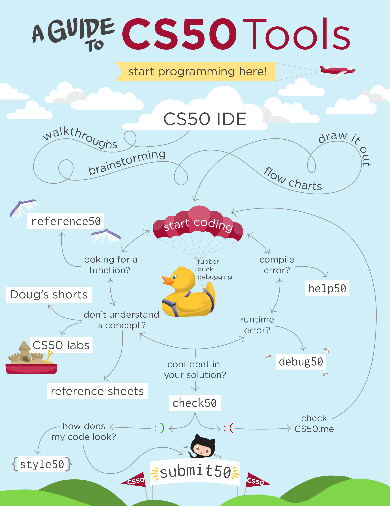
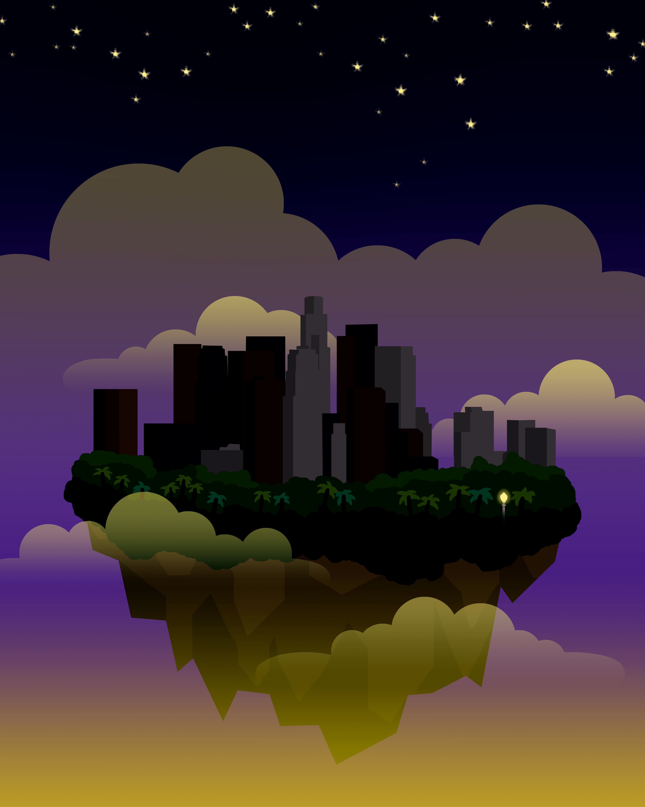

<h1 class="arttitle"><a href="https://ehhong.github.io/identityexploration/">asian american identity project</a><h1>

<h1 class="arttitle">comfort food</h1>

<h1 class="arttitle"><a href="https://cs50.harvard.edu/">CS50</a> tools flowchart, 2018</h1>

<h1 class="arttitle">stilts</h1>

<h1 class="arttitle">citrus</h1>

<h1 class="arttitle">la la land</h1>

<h1 class="arttitle">succulents</h1>

<h1 class="arttitle">figure</h1>

<h1 class="arttitle">the lunchbox moment</h1>

for more works, check out my
  <a href="https://www.instagram.com/elyhng/">instagram (@elyhng)</a>
  and
  <a href="https://society6.com/ehhmily">society6</a>

